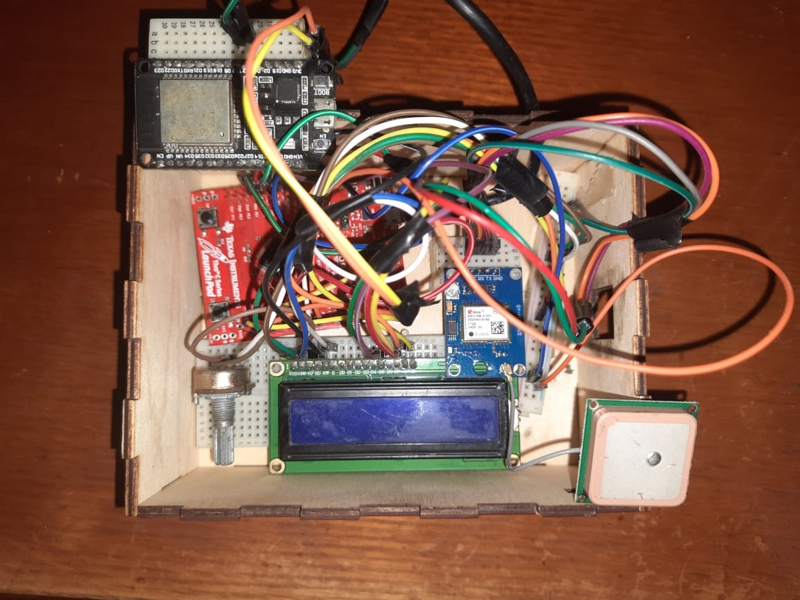

# GPS Tracking System

Our project consists of three main components:
1.	TM4C123GH6PM microcontroller
2.	Ublox NEO-6m GPS Module
3.	Trajectory Plotter web python based app

## Project features

- serial watchdog with esp-32 to monitor the operations and easily debug code.
- flask web server to update the location. 
- shortest path algorithm (A*) along with some other algorithms and structures.
- lcd to print current latitude and longitude beside the accumulated traveled distance.

## TODO

- sensor fusion algorithm with IMU (gyro, accel, magnetometer) to compensate the considerable gps error, also it is a must in high speed scenarios like driving a car. The best and easy-to-implement algorithm is Extended Kalman filter.

- implementing RTOS, the simplest algorithm is Round-Robin, which will prove beneficial in multi-sensor setup  
- implementing interrupt.
- adding simple voice commands to direct the user towards the destination
- correction methods for the distance function

## Team Members

Names | id
----- | ----
Mahmoud Mohamed Mahmoud Ahmed | 2001261
Kareem Amr Mohamed Soliman |2001033
Mahmoud Mohamed Ali Soliman  | 2001866
Mohamed Ahmed Samir Amin | 2001876
Mohamed Yaser Elsaid | 2001226
Yousef Mohamed Ibrahim Mohamed | 2001496
Mohamed Mahmoud Rezk | 2002114
Abdalrahman Esaam Mohamed Elemam Elemam | 1900771

## implementation

## Ports and pins Configuration
### GPS NEO-6m
pins  | GPIO pins
----- | -------------
VDD | Vbus
GND | GND
TX | PE4 *** uart5_rx ***
RX | PE5 *** uart5_tx ***
### LCD
pins  | GPIO pins
----- | -------------
VDD | Vbus
GND | GND
V0  | POT 
RS  | PB0
RW  | PB1
E   | PB2
D4  | PB4
D5  | PB5
D6  | PB6
D7  | PB7  
## idea of working
- When the tiva lunch it first wait for the gps to receieve sentances displaying loading
- when it starts working we use 
  ``` bash
  SW1 ---> set the current location as the end point
  SW2 ---> set the current location as the start point
  ``` 
## Usage 

**LINUX platforms**

- First, download the tivaware (either the full SDK version or TM4c123gxl) from [here](https://www.ti.com/tool/SW-TM4C), this step requires TI account.

- Clone the project to your local machine
 ``` bash
git clone https://github.com/mohamedrezk122/tivac-based-map-router
 ```

- Follow this [tutorial](https://www.hackster.io/tcss/upload-code-to-ti-tm4c123-using-linux-cmake-and-lm4tools-c33cec) on how to setup lm4tools( for flashing binaries to the board), and tivaware.

- Open terminal in project directory and execute the following commands
``` bash
mkdir build
cmake ..
make 
sudo make flash   
```
