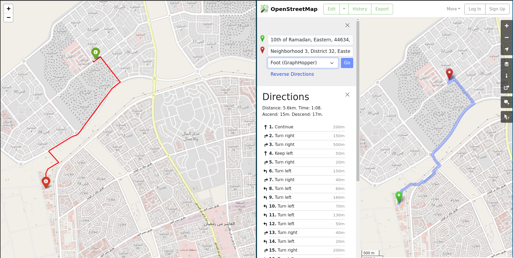
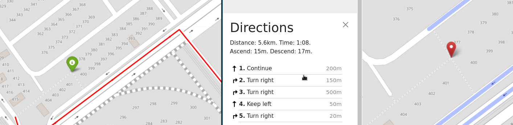

# Google Maps clone 

In this repo, I have implemented a simple algorithm to clone the behavior of google map.

The algorithms and data structures used in the implementation:
    - A* algorithm to find the shortest path between source and destination
    - Priority Queue implemented with min-heap. 
    - Kd-Tree with naive sorting median finding with O(nlog^2n) with default python tim sort algorithm (O(nlogn)).
    - median of medians algorithm with both randomized (average O(n)) and deterministic(O(n)) approaches to speed 
        up kd-tree formation formally in O(nlog(n)).
    - K-nearest-neighbors algorithm for querying a point from the dataset in O(logn).

## fetching and pre-processing map data
- use `fetch_map_from_bounding_box` function to download an OSM/xml file containing map/graph data given a bounding box 
- convert OSM to graphml file with `generate_graphml_from_xml` function, as graphml format has lower size and faster in parsing
- parse the graphml file with networkx and you are ready to go .

## nearest point query
- you can fall in a situation where the provided start and end points you want to find the shortest path between are not present
in the dataset (map file), so the naive approach is O(n) searching over the data and return the point with minimum distance. However,  I have used Kd-tree with KNN to speed up query process. First refine the graph, build the tree and finally query the point.

## A*
- A* is a superior algorithm as it only searches in the direction with potential solution and minimum distance as opposed to Dijkstra's algorithm. I have used haversine  as a heuristic function to compute the distance over a sphere (Earth). Haversine has an acceptable error on small distances.

## Samples

I used these coordinates both with open street maps(right) and my algorithm(right) 
```py
start = (30.3243732 , 31.6886483) 
goal  = (30.3569825 , 31.7031567)
``` 


with the distances 
- 5.6 KM for open street maps
- 5.53 KM for my algorithm 

and it took around **5 seconds** it is *python* after all 

**Nearest neighbor search**

